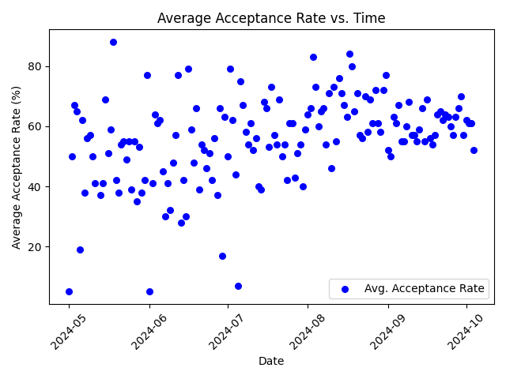

# College V Time Plotter
A simple Python program that plots the acceptance rate of colleges and the date/time that the email was sent.

---

### Graphs of my inbox

August 1st, 2023 - October 4th, 2024


May 1st, 2024 - October 4th, 2024


---

### Graph of avg. acceptance rate per day

May 1st, 2024 - October 4th, 2024


## Dateset from kaijchang's USNews College Scraper: https://github.com/kaijchang/USNews-College-Scraper

---

## To setup:

<ol>
<li>Make sure IMAP is enabled on your gmail account</li>
<li>Allow 3rd party apps in your Google security settings</li>
</ol>

`pip3 install -r requirements.txt`

## To run:
```
python3 Builder.py
python3 Grapher.py
```

Builder makes the dataset from your inbox, and Grapher plots all the data points.

