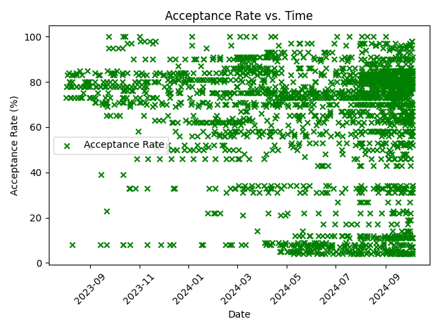
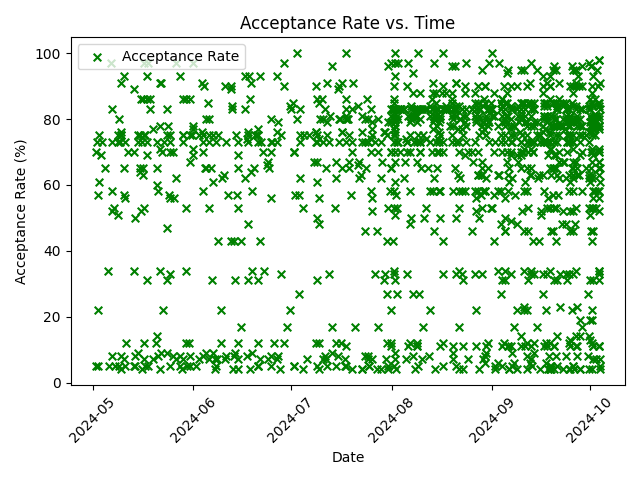

# College V Time Plotter
A simple Python program that plots the acceptance rate of colleges and the date/time that the email was sent.

---

### Graphs of my inbox

August 1st, 2023 - October 4th, 2024


May 1st, 2024 - October 4th, 2024


---

## Dateset from kaijchang's USNews College Scraper: https://github.com/kaijchang/USNews-College-Scraper

---

To setup:
`pip3 install -r requirements.txt`

To run:
```
python3 Builder.py
python3 Grapher.py
```

Builder makes the dataset from your inbox, and Grapher plots all of the data points.

